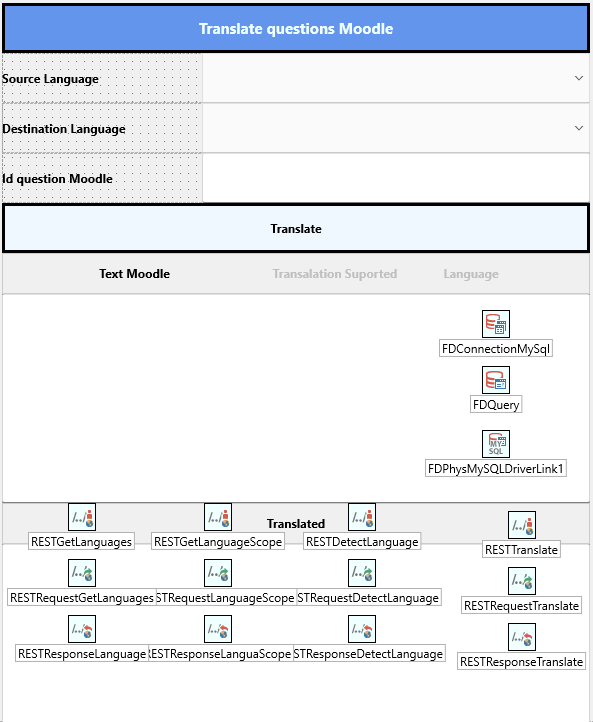
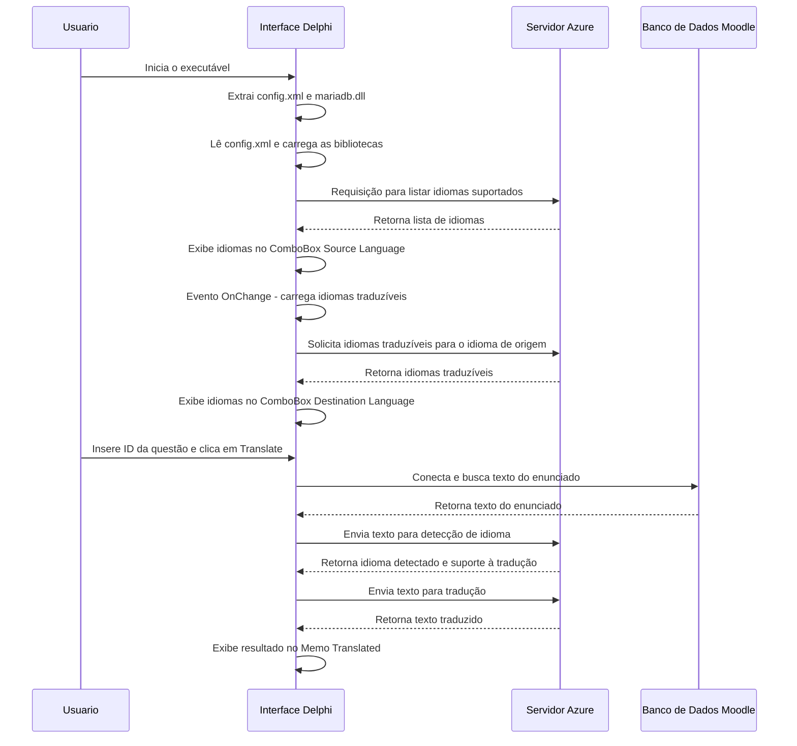

# AzureTranslateMoodle
Using AI to translate questions on LMS Moodle.
# Documentação do Projeto de Tradução com Azure

## Descrição do Projeto
Este projeto foi desenvolvido em Embarcadero Delphi 12 com o objetivo de criar um software de tradução automática utilizando a IA de tradução da Azure. O software é multiplataforma, permitindo a execução em Windows, Android e Linux, e foi projetado para traduzir enunciados de questões criadas no LMS Moodle, que utiliza banco de dados MySQL.

## Estrutura do Projeto

### Tela Inicial


### Diagrama de Classes

**Principais classes e responsabilidades:**
- **TFormPrincipal**: Classe principal que gerencia a interface gráfica e os eventos dos componentes.
- **TRESTClient**: Componente que realiza as requisições REST para os serviços da Azure.
- **TComboBox**: Exibe as opções de idiomas de origem e destino.
- **TConfigManager**: Responsável por carregar e gerenciar os dados de configuração a partir do arquivo `config.xml`.
- **TDatabaseConnector**: Gerencia a conexão com o banco de dados MySQL.

### Diagrama de Sequência


## Estrutura do Arquivo `config.xml`
```xml
<Config>
  <AzureAI>
    <BaseUrlLanguages>https://api.cognitive.microsofttranslator.com/languages</BaseUrlLanguages>
    <BaseUrlLanguageScope>https://api.cognitive.microsofttranslator.com/languages</BaseUrlLanguageScope>
    <BaseUrlDetect>https://api.cognitive.microsofttranslator.com/detect</BaseUrlDetect>
    <BaseUrlTranslate>https://api.cognitive.microsofttranslator.com/translate</BaseUrlTranslate>
    <ContentTypeHeader>Content-Type</ContentTypeHeader>
    <ContentTypeValue>application/json</ContentTypeValue>
    <SubscriptionKeyHeader>Ocp-Apim-Subscription-Key</SubscriptionKeyHeader>
    <SubscriptionKeyValue>YOUR_SUBSCRIPTION_KEY</SubscriptionKeyValue>
    <SubscriptionRegionHeader>Ocp-Apim-Subscription-Region</SubscriptionRegionHeader>
    <SubscriptionRegionValue>brazilsouth</SubscriptionRegionValue>
  </AzureAI>
  <MySQL>
    <Host>localhost</Host>
    <Database>moodle</Database>
    <User>root</User>
    <Password>password</Password>
  </MySQL>
</Config>
```

## Como Utilizar
1. **Configuração Inicial**: Configure o arquivo `config.xml` de acordo com os endpoints e credenciais utilizadas na Azure e os dados da conexão com seu banco de dados MySQL do Moodle.
2. **Interface Gráfica**:
   - **Source Language**: Escolha o idioma de origem.
   - **Destination Language**: O idioma de destino será carregado automaticamente.
   - **ID da Questão**: Insira o ID da questão do Moodle.
   - **Botão `Translate`**: Clique para iniciar a tradução.
3. **Execução**:
   - O sistema obtém o texto do enunciado do banco de dados.
   - Detecta o idioma e verifica a tradutibilidade.
   - Traduz o texto e exibe o resultado no Memo Translated.

## Lista de Desejos (Versão 0.1)
Este projeto foi desenvolvido como parte de um desafio de projeto da Digital Innovation One (DIO). As melhorias planejadas incluem:
1. Ampliar a possibilidade de traduzir as questões do banco de questões do Moodle de uma categoria específica em lote.
2. Realizar o update das traduções no banco de questões do Moodle MySQL.
3. Incluir animações do andamento do progresso das atualizações.

## Contribuição
Sinta-se à vontade para enviar `pull requests` ou abrir `issues` para sugerir melhorias. Este projeto é uma ótima oportunidade para aprender e explorar a integração do Delphi com APIs REST modernas.

## Licença
Este projeto está licenciado sob a [MIT License](LICENSE).


